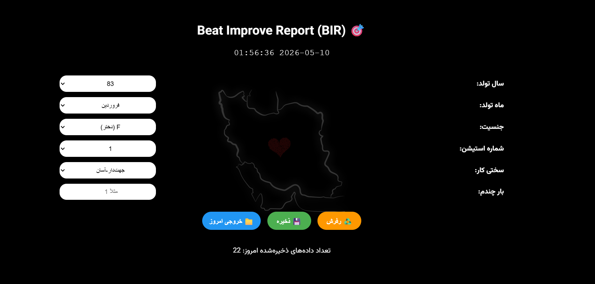

# 🧠 Beat Improve Report (BIR) – Dataset & Cognitive Analytics

[-blue)](https://gemini.google.com)

> **A smart offline data‑collection tool** built to measure how Iranian teenagers discover and optimise game strategies – and how social influence accelerates learning.

---

## 🎯 What is this project?

**Beat Improve Report (BIR)** is both:

- A **pure HTML/CSS/JS offline application** (runs on any device without internet)
- A **research dataset** that will be published in this repository

The app collects structured session data from teenagers playing a cognitive game.  
Each record includes: birth year/month, gender, station type, difficulty, session number, and **score**.

But the real goal is much deeper…

---

## 📸 Pictures

  
  

---

## 🧬 The greater vision – understanding brain optimisation

I want to figure out **how long it takes for human brains, separated by age range**, to:

- Activate the **hippocampus** (memory encoding)
- Engage **short‑term memory** loops
- Find the **best algorithm of the game** without being told the optimal strategy

I study the pathway:

> **Thalamus (high attention) → Cortex → Cerebellum (fine‑tuning) → back to thalamus**

How many sessions does a brain need to send a **major process** from the thalamus with *highly focused attention* into the **cerebellum** – and then execute it in the most optimised way?

This app gives me the raw behavioural data to answer that question.

---

## 🪴 Dataset context – Iranian teenagers

All participants are **Iranian teenagers** (age ~12‑18 years).  
They play the same game under controlled conditions, either:

- Alone (baseline)
- In a social environment (watching peers, hearing best scores, sharing tips)

---

## 📊 Previous informal study – 1680 cases

Before building this digital tool, I ran a **manual study** with **1680 Iranian teenagers**.

**Key finding:**  
The game has an implicit optimal algorithm. Players are never told about it.  
They have to discover it by themselves through trial, error and score.

- **Baseline (playing alone):**  
  Average time to discover the best algorithm → **≈ 18 minutes**.

- **Social condition (in line with other players, watching others play, sharing best performances, listening to others' way):**  
  Average time drops to **≈ 12 minutes**.

That’s a **33% faster learning rate** – purely from social exposure, not from explicit teaching.

**Why?**  
Observing others triggers mirror neurons, accelerates hippocampal pattern matching, and reduces unnecessary cerebellar trial‑and‑error.

This app now allows me to collect the same data **digitally, at scale, with precise timestamps and scores**.

---

## 🧪 What this dataset will help me discover

With the structured records from BIR, I will analyse:

- The **distribution of learning curves** across different age groups 
- The **effect of gender** on strategy discovery
- The **correlation between session number and score improvement**
- Whether the social acceleration effect (18 min → 12 min) holds true in larger digital samples

Ultimately, I aim to model the **cognitive processing time** from thalamic attention to cerebellar optimisation.

> ⚠️ **Data will be published here after anonymisation and basic aggregation.**  

---

## 🛠️ Tech stack (all offline, no build step)

- HTML5 / CSS3 / vanilla JavaScript
- LocalStorage for persistence
- Web Audio API for success/error feedback
- Custom on‑screen numeric keypad (no system keyboard pop‑up)
- Fullscreen toggle (simulates F11)

The entire app is **self‑contained** – works without any internet connection once copied to the tablet.

---

## 🙏 Credits

This project was built with a collaborative effort between human expertise and advanced AI:

- **App Design & Logic** – Conceptualised and developed by **Ali Najjarzadegan**.
- **AI Coding Partners:**
  - **[DeepSeek](https://deepseek.com)** – Instrumental in initial logic structuring and code generation.
  - **[Gemini (Google)](https://gemini.google.com)** – Key role in UI/UX refinement, implementing the numeric keypad layout, audio-visual feedback systems, and ensuring cross-device responsiveness.
- **© Medulator App** – All rights reserved for the “Beat Improve Report” interface and branding.
- **Scientific Foundation** – Inspired by research on hippocampus‑cerebellum loops and social learning.

---

## 📌 Future plans

- Publish the full dataset (anonymised)
- Release a web‑based dashboard to interactively explore learning curves
- Write a research summary (English & Persian) linking neural pathways to behavioural data

---

## 📬 Contact & contributions

This is a personal research project. If you’re a cognitive scientist, game‑based learning researcher, or open‑data enthusiast – feel free to open an issue or reach out.

---

### ⭐ If you find this project interesting, star the repo to follow the dataset release.
